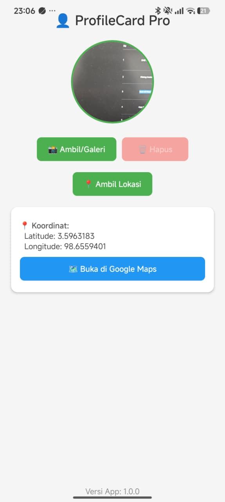
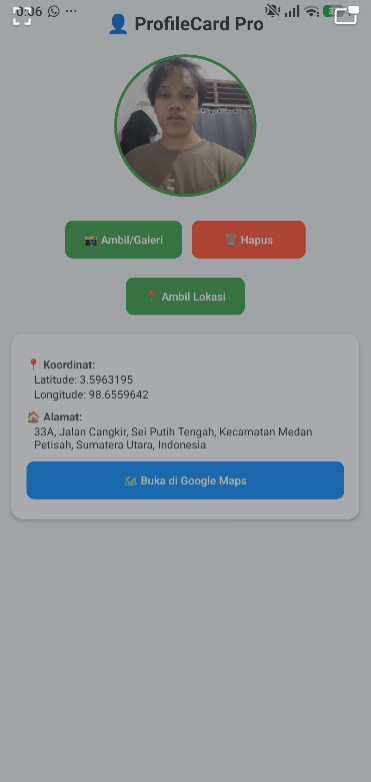
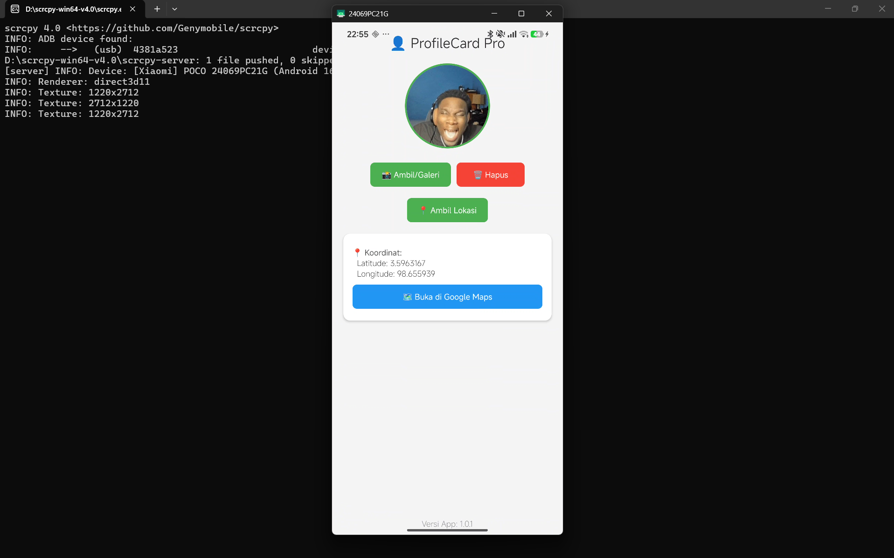
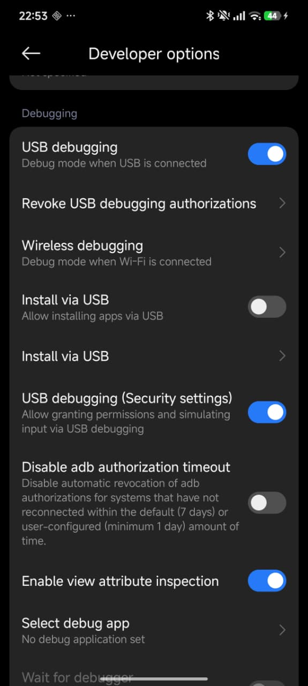
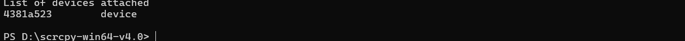

# ProfileCard Pro

---

## 📱 Screenshot Aplikasi

| Halaman Utama | Halaman Lokasi | Halaman Galeri |
| :---: | :---: | :---: |
|  |  |  |

---

## 🔧 Dokumentasi Live Test (Scrcpy & ADB)

**1. Scrcpy Mirroring (HP ke Laptop)**  

**2. USB Debugging ON**  

**3. ADB Devices Terdeteksi**  

---

## 👨‍💻 Developer
- **Nama:** [GANTI NAMA LENGKAP KAMU]
- **NIM:** [GANTI NIM KAMU]
- **Kampus:** [GANTI NAMA KAMPUS KAMU]

# 📱 ProfileCard Pro

Aplikasi profil dengan fitur kamera dan GPS. Dibangun dengan Expo & React Native.

---

## ✨ Fitur Utama
- 📸 Ambil Foto dari Kamera
- 🖼️ Pilih Foto dari Galeri
- 📍 Deteksi Lokasi GPS & Reverse Geocoding
- 🗺️ Buka Google Maps
- 💾 Penyimpanan Data Otomatis (AsyncStorage)
- ℹ️ Tampilan Versi Aplikasi (Bonus A)

---

## 📥 Download APK

**Versi terbaru (v1.0.1 - Build Kedua):**  
🔗 [Download APK v1.0.1](https://expo.dev/accounts/idhos/projects/profilecard-pro/builds/7bcb0baa-f2e2-4cf5-80c9-cb9de2361d1f)

**Versi awal (v1.0.0):**  
🔗 [Download APK v1.0.0](https://expo.dev/accounts/idhos/projects/profilecard-pro/builds/0c86acee-33c9-4f25-96d6-78f1818db24d)

> ⚠️ *Link APK hanya aktif 30 hari sejak build selesai.*

---

## 🛠 Cara Install di HP
1. Download file `.apk` dari link di atas.
2. Buka file APK di HP Android.
3. Jika muncul peringatan "Unknown sources", izinkan instalasi.
4. Klik **Install**, tunggu hingga selesai.
5. Buka aplikasi "ProfileCard Pro" dari menu utama HP.

---

## 📱 Screenshots & Dokumentasi

### 1. Proses Build (EAS Dashboard) — Status FINISHED

---

### 2. Proses Instalasi APK di HP

  
  

---

### 3. Icon Aplikasi di Home Screen / App Drawer

---

### 4. Video App Berjalan di HP (Tanpa Expo Go)
<a href="https://github.com/user-attachments/assets/0c6d2415-acce-4d8c-abe7-fc06f308d16a">▶️ Klik untuk melihat video demo</a>

---

### 5. Tampilan Versi App di Footer (Bonus A)

---

### 6. Build Kedua & Perubahan UI (Bonus C)

---

## 🍱 Coba Online via Expo Snack (Bonus B)
Jalankan versi interaktif aplikasi ini langsung di browser:

🔗 **[ProfileCard Pro di Expo Snack](https://snack.expo.dev/@idhos/profile_app)**

---

## ⚙️ Teknologi yang Digunakan
- [Expo](https://expo.dev/) SDK 54
- [React Native](https://reactnative.dev/)
- [EAS Build](https://docs.expo.dev/build/)
- [expo-image-picker](https://docs.expo.dev/versions/latest/sdk/imagepicker/)
- [expo-location](https://docs.expo.dev/versions/latest/sdk/location/)
- [AsyncStorage](https://react-native-async-storage.github.io/async-storage/)
- [expo-constants](https://docs.expo.dev/versions/latest/sdk/constants/) (Bonus A)

---

## 📌 Changelog

### v1.0.1 (Build Kedua - Bonus C)
- **Perubahan UI:** Warna background diubah dari abu-abu (#f5f5f5) menjadi hijau muda (#e8f5e9) untuk tampilan lebih segar.
- **Update versi:** 1.0.1 (versionCode: 2)
- **Link APK:** [Download v1.0.1](https://expo.dev/accounts/idhos/projects/profilecard-pro/builds/7bcb0baa-f2e2-4cf5-80c9-cb9de2361d1f)

### v1.0.0 (Rilis Pertama)
- Initial release dengan fitur kamera, galeri, dan GPS.
- Versi: 1.0.0 (versionCode: 1)
- Penyimpanan data dengan AsyncStorage.
